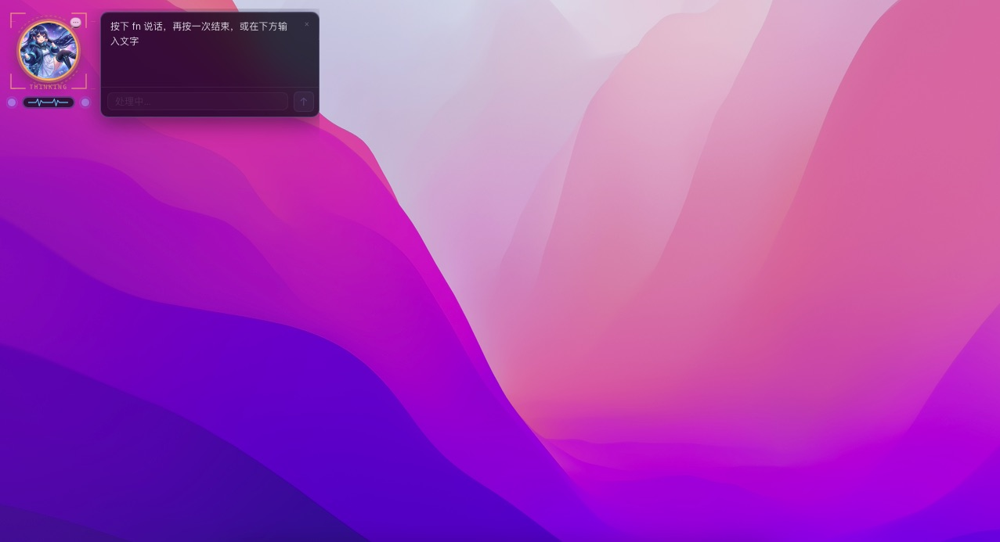
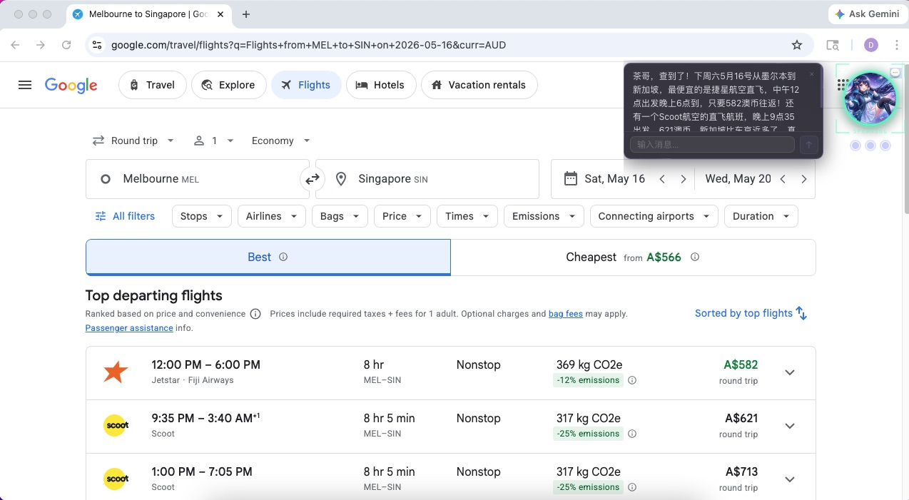

# Pocket Agent

> A minimal desktop AI voice companion that lives on your screen — press a key, speak, get things done.
>
> **v0.2.3** — see [releases/0.2.3.md](releases/0.2.3.md) for changelog

Pocket Agent is a compact desktop widget built with **Tauri 2 + Svelte 5 + Rust**. It connects to a local AI agent gateway ([Hermes](https://github.com/nousresearch/hermes) or [OpenClaw](https://github.com/nousresearch/openclaw)) via SSE streaming for real-time voice conversations with an LLM. Think of it as a desktop pet that actually helps.

---

## How It Works

```
+-------------------------------------------------------------+
|                      Pocket Agent                            |
|  +----------+  +----------+  +---------------------------+  |
|  |  Avatar   |  |  Chat    |  |  Dynamic Island           |  |
|  |  Widget   |  |  Panel   |  |  (recording indicator)    |  |
|  +----------+  +----------+  +---------------------------+  |
|       |             |                                        |
|  Svelte 5      Svelte 5                                     |
|  (frontend)    (frontend)                                   |
|       |             |                                        |
|  +----+-------------+------------------------------------+  |
|  |              Tauri Bridge                               |  |
|  |         (invoke / events / state)                      |  |
|  +----+-------------+------------------------------------+  |
|       |             |                                        |
|  +----+------+  +---+-----------+                            |
|  |  Voice    |  |    Chat       |                            |
|  |  Pipeline |  |    Engine     |                            |
|  |           |  |               |                            |
|  | - hotkey  |  | - SSE stream  |                            |
|  | - record  |  | - TTS play    |                            |
|  | - STT     |  | - lang detect |                            |
|  +----+------+  +---+-----------+                            |
+-------+-------------+----------------------------------------+
        |             |
   WAV audio     HTTP/SSE
        |             |
        v             v
  +----------+   +--------------+
  | Whisper  |   | Hermes /     |
  | (local)  |   | OpenClaw     |
  +----------+   | :8642/:18789 |
                 +--------------+
```

### Voice Pipeline

1. **Press hotkey** (default: `fn`) — macOS CGEventTap captures the global hotkey
2. **Recording starts** — pre-warmed cpal Stream Daemon activates instantly (~11ms latency)
3. **Press hotkey again** — recording stops, WAV saved to temp file
4. **STT** — faster-whisper transcribes locally (auto language detection)
5. **Send to backend** — text + voice hint streamed to configured gateway (Hermes :8642 or OpenClaw :18789) via `/v1/chat/completions`
6. **TTS playback** — edge-tts generates audio, rodio plays it via system speakers

Press **Escape** during recording to cancel. Minimum recording: 1.5s. Maximum: 30s (auto-cutoff).

---

## Features

- **Voice-first interaction** — push-to-talk with local Whisper STT, no cloud dependency for speech recognition
- **Real-time streaming** — SSE streaming from LLM with live text display
- **TTS voice response** — edge-tts with automatic language detection (Chinese, English, Japanese, Korean + more)
- **Session memory** — daily auto-rotating sessions with compressed context summaries
- **Language tracking** — auto-detects user language per message, follows user's language seamlessly
- **Local command tags** — `[CMD:...]` for local automation tasks (disabled by default, enable via `ENABLE_LOCAL_COMMANDS=true` in `.env`)
- **OpenClaw support** — connect to OpenClaw gateway with multi-agent routing (openclaw/zhenyan, openclaw/qingyin, etc.); server connection configured via `.env` only
- **Multi-language voice** — configure primary + auxiliary TTS voices, auto-switch based on detected language
- **Configurable hotkey** — capture any key via Settings, no restart required
- **TTS toggle** — disable voice output for text-only mode
- **Compact widget** — 220x360px always-on-top window, dark sci-fi aesthetic
- **macOS native** — global hotkey via CGEventTap, CoreAudio recording, menu bar tray

---

### Push API

Pocket Agent runs a local HTTP server on port `8650` for receiving push messages from external sources (Hermes cron jobs, scripts, etc.):

- **POST /push** — `{"text": "...", "emotion": "cheerful"}` → speaks and displays the message
- **GET /health** — health check
- Auth via `API_SERVER_KEY` Bearer token

See [releases/0.1.1.md](releases/0.1.1.md) for full API details.

---

## Tech Stack

**Frontend (Svelte 5)**
- Svelte 5 with runes (`$state`, `$derived`, `$effect`, `$props()`) + TypeScript
- Vite 6

**Desktop (Tauri 2 / Rust)**
- Tokio + reqwest + eventsource-stream
- cpal + hound (recording), rodio (playback)
- CGEventTap (macOS FFI) for global hotkey

**AI / Voice**
- [Hermes Agent](https://github.com/nousresearch/hermes) gateway (default `http://localhost:8642`)
- [OpenClaw](https://github.com/nousresearch/openclaw) gateway (default `http://localhost:18789`) with multi-agent routing via model field
- [faster-whisper](https://github.com/SYSTRAN/faster-whisper) for local speech-to-text
- [edge-tts](https://github.com/rany2/edge-tts) for text-to-speech
- Any OpenAI-compatible LLM (tested with GLM-5 on Hermes, Qwen/QwQ on OpenClaw)

---

## Backend Compatibility

| Backend | Status | Notes |
|---------|--------|-------|
| **Hermes Agent** | Supported | Primary tested backend |
| **OpenClaw** | Supported | Multi-agent routing via model field, ENV-driven |
| **Other OpenAI-compatible** | Possible | Must support `/v1/chat/completions` streaming |

Pocket Agent communicates via OpenAI-compatible chat completions API over SSE. Any server implementing this interface can be used as a drop-in replacement.

---

## Privacy and Security

Pocket Agent is a local desktop client. Please understand these boundaries:

- **API key handling** — `API_SERVER_KEY` is stored in `.env` (plaintext on disk). Never commit `.env` to version control.
- **Global input monitoring** — the hotkey listener uses macOS Accessibility APIs (CGEventTap). This grants system-level input monitoring capability. Only run builds you trust.
- **Microphone access** — audio is captured via CoreAudio and processed **entirely locally** by faster-whisper. No audio data leaves your machine for STT.
- **Conversation persistence** — sessions are stored in the configured gateway (Hermes: `~/.hermes/sessions/`, OpenClaw: `~/.openclaw/agents/<agent>/sessions/`). These contain full conversation text. Consider disk encryption.

### Local Command Execution

`[CMD:...]` command execution is **off by default**. Enable via `ENABLE_LOCAL_COMMANDS=true` in `.env`.

When disabled:
- The system prompt does not mention `[CMD:...]` — the LLM has no knowledge of this capability.
- Enable via `ENABLE_LOCAL_COMMANDS=true` in `.env` (project root for dev, `~/.pocket-agent/.env` for packaged app).
- Even if the LLM outputs `[CMD:...]` tags (e.g., through prompt injection), they are stripped and never executed.

When enabled, commands run via `sh -c`. Only enable this if you trust your backend and runtime environment.

### Security Philosophy

Pocket Agent is a **voice interface** — it provides a communication channel between the user and an AI agent. It is not a security gateway.

The responsibility for safe operation is shared across three layers:

1. **Pocket Agent (this app)** — provides the voice/text interface. We add guard rails where practical (e.g., `ENABLE_LOCAL_COMMANDS` default-off in `.env`) to prevent accidental misuse, but we do not attempt to fully sandbox the agent.
2. **Agent Framework (Hermes)** — the backend that hosts the LLM. It decides what the agent can and cannot do: which tools are available, what APIs are accessible, what system prompts govern behavior. Security policies belong here.
3. **User** — you decide what agent you connect to, what permissions you grant, and what data you share.

**In short: Pocket Agent is the telephone, not the security guard.** What the agent on the other end can do is determined by the agent framework and your configuration — not by the client.

---

## Getting Started

> **For agent-driven installation** (PA and Hermes/OpenClaw on the same machine): see [README_AGENTS.md](README_AGENTS.md)

### Before You Run

- macOS with Accessibility and Microphone permissions available
- Rust toolchain installed
- Node.js 18+ and npm
- Python 3.10+ with `faster-whisper` and `edge-tts`
- Hermes or OpenClaw gateway running and reachable

### Prerequisites

- **macOS** (primary supported platform today)
- **Rust** — [install](https://rustup.rs/)
- **Node.js** 18+ and npm
- **Python 3.10+** — install voice dependencies:

```bash
# edge-tts for text-to-speech
pipx install edge-tts

# faster-whisper for local speech-to-text
pip install faster-whisper
```

> For the **packaged app** (built `.dmg`), Python deps must be available globally or via `pipx`.  
> If `edge-tts` is not in PATH, set `EDGE_TTS_BIN` in `~/.pocket-agent/.env`.  
> If `faster-whisper` Python is not the system default, set `STT_PYTHON` in `~/.pocket-agent/.env`.

- **Backend gateway** — [Hermes Agent](https://github.com/nousresearch/hermes) (`localhost:8642`) or [OpenClaw](https://github.com/nousresearch/openclaw) (`localhost:18789`)

### Setup

1. **Clone and install dependencies:**

```bash
git clone https://github.com/kevin-ping/pocket-agent.git
cd pocket-agent
npm install
```

2. **Configure environment:**

```bash
cp .env.example .env
```

For development (`tauri dev`), edit `.env` in the project root.  
For the **packaged app** (`.dmg`), create `~/.pocket-agent/.env` instead.

All server connection settings (`API_SERVER`, `API_SERVER_KEY`, `API_AGENT`, `ENABLE_LOCAL_COMMANDS`) are configured **only** via `.env`:

```bash
# Required: backend connection
API_SERVER=http://localhost:8642
API_SERVER_KEY=           # leave empty for no auth
API_AGENT=xingyin         # agent name

# Optional
# ENABLE_LOCAL_COMMANDS=true
# EDGE_TTS_BIN=/path/to/edge-tts
# STT_PYTHON=/path/to/python3
```

3. **Run in development mode:**

```bash
npm run tauri dev
```

First build takes 3-5 minutes for Rust compilation. Subsequent builds are ~20 seconds.

### macOS Permissions

On first launch, grant in **System Settings → Privacy & Security**:

1. **Accessibility** — required for global hotkey capture. Add Pocket Agent, then **restart the app**.
2. **Microphone** — prompted automatically on first recording.

If Accessibility was denied initially, re-enable it and restart the app.

---

## Configuration

Open **Settings** from the tray menu.

- **Server connection** — API server URL, auth key, agent name, and local commands are configured via `.env` only (see `.env.example`)
- **Avatar image** — optional custom character avatar
- **Record Key** — capture any key as your push-to-talk hotkey (default: `fn`). Changes take effect immediately.
- **TTS voices** — primary, auxiliary 1, auxiliary 2 (grouped by language)
- **Fixed language mode** — force LLM to always respond in a specific language
- **Voice Output** — enable/disable TTS playback. When off, responses are text-only.
- **Audio format** — WAV (lossless) or MP3 (compact)

Settings persist via Tauri store.

---

## Airline Enquiry Demo

Pocket Agent can display results from tool-using backends (e.g., a web-enabled Hermes setup):

**Query:**



**Result:**



---

## Project Structure

```
pocket-agent/
├── src/                          # Svelte 5 frontend
│   ├── App.svelte                # Main container + event orchestration
│   ├── main.ts                   # Entry point
│   └── lib/
│       ├── components/
│       │   ├── AvatarIcon.svelte  # Character avatar + expand button
│       │   ├── ChatPanel.svelte   # Chat input + message display
│       │   ├── ContextMenu.svelte # Right-click context menu
│       │   ├── DialogBox.svelte   # Dialog bubble with typewriter effect
│       │   ├── DynamicIsland.svelte # Recording indicator
│       │   ├── Icon.svelte       # SVG inline icon component (Lucide style)
│       │   ├── RecordingCapsule.svelte # Active recording timer
│       │   └── SettingsPanel.svelte # Settings (General / Voice)
│       ├── stores/
│       │   ├── chat.ts           # Chat message store
│       │   ├── character.ts      # Character animation state
│       │   ├── layout.ts         # Window layout constants
│       │   └── settings.ts       # Persistent settings store
│       └── i18n.ts               # Language detection utilities
├── src-tauri/                    # Rust backend
│   ├── Cargo.toml                # Rust dependencies
│   ├── tauri.conf.json           # Tauri window + tray config
│   ├── resources/
│   │   └── stt-helper            # Python STT script (faster-whisper)
│   └── src/
│       ├── main.rs               # App entry
│       ├── lib.rs                # State, tray menu, plugin setup
│       ├── api/
│       │   └── client.rs         # Hermes SSE client
│       ├── commands/
│       │   ├── chat.rs           # send_message: SSE → TTS → emit
│       │   ├── config.rs         # Settings persistence + voice hints
│       │   └── voice.rs          # Recording lifecycle commands
│       └── voice/
│           ├── hotkey.rs         # Global hotkey capture (CGEventTap)
│           ├── record.rs         # Audio recording (cpal) + pre-warm
│           └── stt.rs            # Whisper transcription wrapper
├── assets/
│   └── media/                    # Demo videos + screenshots
├── .env.example                  # Environment template
└── README.md
```

---

## Development

```bash
# Frontend type check
npx svelte-check

# Rust compilation check
cd src-tauri && cargo check

# Production build
npm run tauri build
```

---
---

## License

MIT
