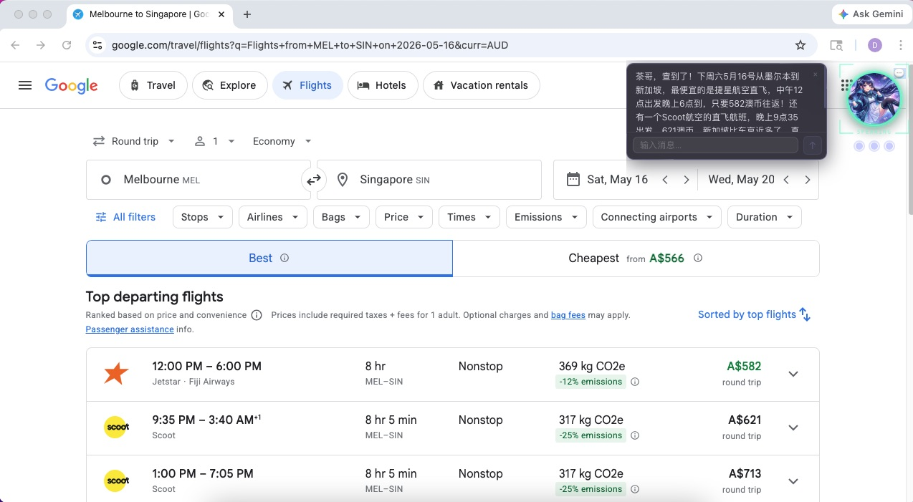

# Pocket Agent

> A minimal desktop AI voice companion that lives on your screen — press a key, speak, get things done.
>
> **v0.2.9** — see [releases/0.2.9.md](releases/0.2.9.md) for changelog

Pocket Agent is a compact desktop widget built with **Tauri 2 + Svelte 5 + Rust**. It connects to a local AI agent gateway ([Hermes](https://github.com/nousresearch/hermes) or [OpenClaw](https://github.com/nousresearch/openclaw)) via SSE streaming for real-time voice conversations with an LLM. Think of it as a desktop pet that actually helps.

---

## On-demand computer interaction

Install Hermes and Pocket Agent on each Mac, then enable the Hermes API computer tool and grant CuaDriver permissions. A separate semantic routing pass classifies each current request: search, lookup, and app-operation requests use the visible local browser or app by default, while an explicit request for results only or background research keeps the desktop untouched. Ordinary conversation and knowledge explanations do not open apps. Visible routes reject Hermes' internal headless-browser and command tools instead of treating them as local interaction. Text and voice requests can inspect a window, perform an authorized action, and read it again to check the result. The main model may be text-only; Hermes can use auxiliary vision when pixels are needed. See the [Mac installation and troubleshooting guide](docs/computer-interaction.md). The chat panel includes **▣** to inspect and **ⓘ** to check setup; no continuous screen monitoring is enabled.

## How It Works

```
+-------------------------------------------------------------+
|                      Pocket Agent                            |
|  +----------+  +----------+  +---------------------------+  |
|  |  Avatar   |  |  Chat    |  |  Dynamic Island           |  |
|  |  Widget   |  |  Panel   |  |  (recording indicator)    |  |
|  +----------+  +----------+  +---------------------------+  |
|       |             |                                        |
|  Svelte 5      Svelte 5                                     |
|  (frontend)    (frontend)                                   |
|       |             |                                        |
|  +----+-------------+------------------------------------+  |
|  |              Tauri Bridge                               |  |
|  |         (invoke / events / state)                      |  |
|  +----+-------------+------------------------------------+  |
|       |             |                                        |
|  +----+------+  +---+-----------+                            |
|  |  Voice    |  |    Chat       |                            |
|  |  Pipeline |  |    Engine     |                            |
|  |           |  |               |                            |
|  | - hotkey  |  | - SSE stream  |                            |
|  | - record  |  | - TTS play    |                            |
|  | - STT     |  | - lang detect |                            |
|  +----+------+  +---+-----------+                            |
+-------+-------------+----------------------------------------+
        |             |
   WAV audio     HTTP/SSE
        |             |
        v             v
  +------------------+   +--------------+
  | Voice service    |   | Hermes /     |
  | :8651 (local)    |   | OpenClaw     |
  | Whisper + VAD    |   | :8642/:18789 |
  | + speaker + KWS  |   +--------------+
  +------------------+
```

### Voice Pipeline

1. **Press hotkey** (default: `fn`) — macOS CGEventTap captures the global hotkey
2. **Recording starts** — pre-warmed cpal Stream Daemon activates instantly (~11ms latency)
3. **Press hotkey again** — recording stops, WAV saved to temp file
4. **STT** — faster-whisper transcribes locally (auto language detection, configurable model via `STT_MODEL`)
5. **Send to backend** — text + voice hint streamed to configured gateway (Hermes :8642 or OpenClaw :18789) via `/v1/chat/completions`
6. **TTS playback** — edge-tts generates audio, rodio plays it via system speakers

Press **Escape** during recording to cancel. Minimum recording: 1.5s. Maximum: 30s (auto-cutoff).

### Resident Voice Service

Steps 4 and onward do not spawn a fresh Python process per utterance. Pocket Agent starts a
**resident voice service on `127.0.0.1:8651`** (`src-tauri/resources/stt-server.py`, FastAPI)
that keeps Whisper, Silero VAD, the speaker model and the KWS model loaded:

| Endpoint | Purpose |
|---|---|
| `POST /transcribe` | Whisper transcription (VAD short-circuits silent audio to avoid hallucination) |
| `POST /vad`, `POST /vad/check` | Silero VAD — speech present? used by the barge-in confirmation gate |
| `POST /speaker/embed`, `/speaker/enroll`, `/speaker/train` | voiceprint enrollment and matching |
| `GET /kws/status`, `POST /kws/install`, `/kws/session`, `/kws/audio/{sid}`, `/kws/check` | sherpa-onnx keyword spotting for the wake word |
| `GET /health` | liveness |

If the HTTP path fails, transcription falls back to a one-shot subprocess, so dictation keeps
working (slower, and without the VAD short-circuit).

`/speaker/*` and `/kws/*` are protected: they require a bearer token written to
`~/.pocket-agent/server.token` at service startup **and** an `Origin` from the Tauri webview,
so a page in your browser cannot drive them.

### Hands-Free Path

With the wake word enabled there is a second entry point that needs no keypress:

```
always-on mic → sherpa-onnx KWS (wake phrase)
              → [optional] speaker verification (owner-only)
              → conversation turn loop (silence timeout ends each turn)
              → barge-in: sustained RMS + Silero VAD confirmation interrupts TTS
```

---

## Features

- **Voice-first interaction** — push-to-talk with local Whisper STT, no cloud dependency for speech recognition
- **Real-time streaming** — SSE streaming from LLM with live text display
- **TTS voice response** — edge-tts with automatic language detection (Chinese, English, Japanese, Korean + more)
- **Session memory** — daily auto-rotating sessions with compressed context summaries
- **Language tracking** — auto-detects user language per message, follows user's language seamlessly
- **OpenClaw support** — connect to OpenClaw gateway with multi-agent routing (openclaw/agent-a, openclaw/agent-b, etc.); server connection configured via `.env` only
- **Multi-language voice** — configure primary + auxiliary TTS voices, auto-switch based on detected language
- **Configurable hotkey** — capture any key via Settings, no restart required
- **Local + SSH hotkey parity** — fn/globe and modifier hotkeys behave consistently whether PA is launched locally or from an SSH session
- **Wake word (hands-free)** — always-on sherpa-onnx keyword spotting, optionally gated by speaker verification so only your voice triggers it
- **Continuous conversation** — turn loop with silence-based turn ending; no keypress per utterance
- **Barge-in** — talk over the assistant to interrupt it; a Silero VAD confirmation gate rejects non-speech noise
- **Resident voice service** — Whisper / VAD / speaker / KWS models stay loaded on `:8651`, with a subprocess fallback if it is unreachable
- **On-demand desktop interaction** — semantic routing decides per request whether to act in your visible browser/app via Hermes `computer_use`, retrieve in the background, or just talk
- **Settings center** — SQLite-backed settings UI in its own window
- **Interruptible TTS** — pressing the hotkey while PA is speaking stops current audio immediately before recording starts
- **TTS toggle** — disable voice output for text-only mode
- **Compact widget** — 220x360px always-on-top window, dark sci-fi aesthetic
- **macOS native** — global hotkey via CGEventTap, CoreAudio recording, menu bar tray

---

### API

Pocket Agent runs a local HTTP server on port `8650`.

- **POST /push** — push message for TTS playback
- **POST /bridge/send** — bridge third-party apps to Hermes
- **GET /health** — health check

See [docs/API_MANUAL.md](docs/API_MANUAL.md) for full API details.

---

## Tech Stack

**Frontend (Svelte 5)**
- Svelte 5 with runes (`$state`, `$derived`, `$effect`, `$props()`) + TypeScript
- Vite 6

**Desktop (Tauri 2 / Rust)**
- Tokio + reqwest + eventsource-stream
- cpal + hound (recording), rodio (playback)
- CGEventTap (macOS FFI) for global hotkey

**AI / Voice**
- [Hermes Agent](https://github.com/nousresearch/hermes) gateway (default `http://localhost:8642`)
- [OpenClaw](https://github.com/nousresearch/openclaw) gateway (default `http://localhost:18789`) with multi-agent routing via model field
- [faster-whisper](https://github.com/SYSTRAN/faster-whisper) for local speech-to-text
- [edge-tts](https://github.com/rany2/edge-tts) for text-to-speech
- Any OpenAI-compatible LLM (tested with GLM-5 on Hermes, Qwen/QwQ on OpenClaw)

---

## Backend Compatibility

| Backend | Status | Notes |
|---------|--------|-------|
| **Hermes Agent** | Supported | Primary tested backend |
| **OpenClaw** | Supported | Multi-agent routing via model field, ENV-driven |
| **Other OpenAI-compatible** | Possible | Must support `/v1/chat/completions` streaming |

Pocket Agent communicates via OpenAI-compatible chat completions API over SSE. Any server implementing this interface can be used as a drop-in replacement.

---

## Privacy and Security

Pocket Agent is a local desktop client. Please understand these boundaries:

- **API key handling** — `API_SERVER_KEY` is stored in `.env` (plaintext on disk). Never commit `.env` to version control.
- **Global input monitoring** — the hotkey listener uses macOS Accessibility APIs (CGEventTap). This grants system-level input monitoring capability. Only run builds you trust.
- **Microphone access** — audio is captured via CoreAudio and processed **entirely locally** by faster-whisper. No audio data leaves your machine for STT.
- **Conversation persistence** — sessions are stored in the configured gateway (Hermes: `~/.hermes/sessions/`, OpenClaw: `~/.openclaw/agents/<agent>/sessions/`). These contain full conversation text. Consider disk encryption.

### Desktop Interaction

Pocket Agent has **no local shell execution path**. Desktop work goes through the Hermes `computer_use` tool, which carries its own approval gates — see [docs/computer-interaction.md](docs/computer-interaction.md). Any `[CMD:...]`-style tags a backend emits (e.g. through prompt injection) are stripped from output and never executed.

### Security Philosophy

Pocket Agent is a **voice interface** — it provides a communication channel between the user and an AI agent. It is not a security gateway.

The responsibility for safe operation is shared across three layers:

1. **Pocket Agent (this app)** — provides the voice/text interface. We add guard rails where practical (e.g., no client-side shell execution) to prevent accidental misuse, but we do not attempt to fully sandbox the agent.
2. **Agent Framework (Hermes)** — the backend that hosts the LLM. It decides what the agent can and cannot do: which tools are available, what APIs are accessible, what system prompts govern behavior. Security policies belong here.
3. **User** — you decide what agent you connect to, what permissions you grant, and what data you share.

**In short: Pocket Agent is the telephone, not the security guard.** What the agent on the other end can do is determined by the agent framework and your configuration — not by the client.

---

## Getting Started

> **For agent-driven installation** (PA and Hermes/OpenClaw on the same machine): see [README_AGENTS.md](README_AGENTS.md)

### Before You Run

- macOS with Accessibility and Microphone permissions available
- Rust toolchain installed
- Node.js 18+ and npm
- Python 3.10+ with `faster-whisper` and `edge-tts`
- Hermes or OpenClaw gateway running and reachable

### Prerequisites

- **macOS** (primary supported platform today)
- **Rust** — [install](https://rustup.rs/)
- **Node.js** 18+ and npm
- **Python 3.10+** — install voice dependencies:

```bash
# edge-tts for text-to-speech
pipx install edge-tts

# faster-whisper for local speech-to-text
pip install faster-whisper
```

> For the **packaged app** (built `.dmg`), Python deps must be available globally or via `pipx`.  
> If `edge-tts` is not in PATH, set `EDGE_TTS_BIN` in `~/.pocket-agent/.env`.  
> If `faster-whisper` Python is not the system default, set `STT_PYTHON` in `~/.pocket-agent/.env`.

- **Backend gateway** — [Hermes Agent](https://github.com/nousresearch/hermes) (`localhost:8642`) or [OpenClaw](https://github.com/nousresearch/openclaw) (`localhost:18789`)

### Setup

1. **Clone and install dependencies:**

```bash
git clone https://github.com/YOUR_USERNAME/pocket-agent.git
cd pocket-agent
npm install
```

2. **Configure environment:**

```bash
cp .env.example .env
```

For development (`tauri dev`), edit `.env` in the project root.  
For the **packaged app** (`.dmg`), create `~/.pocket-agent/.env` instead.

All server connection settings (`API_SERVER`, `API_SERVER_KEY`, `API_AGENT`) are configured **only** via `.env`:

```bash
# Required: backend connection
API_SERVER=http://localhost:8642
API_SERVER_KEY=           # leave empty for no auth
API_AGENT=my-agent         # agent name

# Optional
# EDGE_TTS_BIN=/path/to/edge-tts
# STT_PYTHON=/path/to/python3
# STT_MODEL=base  # Whisper model: tiny | base | small
```

3. **Run in development mode:**

```bash
npm run tauri dev
```

First build takes 3-5 minutes for Rust compilation. Subsequent builds are ~20 seconds.

### macOS Permissions

On first launch, grant in **System Settings → Privacy & Security**:

1. **Accessibility** — required for global hotkey capture. Add Pocket Agent, then **restart the app**.
2. **Microphone** — prompted automatically on first recording.
3. **Input Monitoring** — required when running `npm run tauri dev` from a terminal app (for example iTerm2). Grant it to the terminal you use to launch PA, then restart that terminal.

If Accessibility was denied initially, re-enable it and restart the app. If local dev hotkeys still do nothing after that, check the terminal app's Input Monitoring permission before debugging the code.

---

## Configuration

Open **Settings** from the tray menu.

- **Server connection** — API server URL, auth key, and agent name are configured via `.env` only (see `.env.example`)
- **Avatar image** — optional custom character avatar
- **Record Key** — capture any key as your push-to-talk hotkey (default: `fn`). Changes take effect immediately.
- **TTS voices** — primary, auxiliary 1, auxiliary 2 (grouped by language)
- **Fixed language mode** — force LLM to always respond in a specific language
- **Voice Output** — enable/disable TTS playback. When off, responses are text-only.

- **Wake-word detection** — hands-free activation via speaker recognition + keyword matching (see below)

### Wake-Word Configuration

Pocket Agent supports hands-free activation with a **sherpa-onnx keyword spotter (KWS)** running inside the resident voice service, optionally gated by **speaker verification** so only your voice triggers it.

Configured in **Settings → Voice** (not via `.env`):

- **Wake word enabled** — turns the always-on KWS listener on or off
- **Wake phrase** — the keyword the spotter listens for
- **KWS threshold** (`wake_kws_threshold`) — keyword match confidence; raise it if the phrase fires on similar-sounding speech
- **Owner only** (`wake_owner_only`) — when on, a keyword hit must also pass speaker verification against your enrolled voiceprint
- **Speaker threshold** (`wake_word_threshold`) — how close the voice must match the enrolled voiceprint

Voiceprint enrollment and the KWS model download are driven from the same settings page; they call the resident voice service's `/speaker/*` and `/kws/*` endpoints.

### Continuous Conversation

After a wake word (or hotkey), Pocket Agent can stay in a conversation turn loop instead of requiring a press per utterance:

- **Silence timeout** (`silence_timeout_secs`) — how long a pause ends your turn
- **Barge-in** (`barge_in_enabled`, `barge_in_rms_threshold`) — speak over the assistant to interrupt it. A sustained RMS level arms the interrupt, and a **Silero VAD** second opinion confirms it is speech and not a door slam or keyboard noise. Interrupting a conversation turn additionally requires the wake word, so background talk does not cut the assistant off.

Settings persist in a local **SQLite** database under `~/.pocket-agent/` (see `src-tauri/src/commands/settings_repository.rs`).

---

## Airline Enquiry Demo

Pocket Agent can display results from tool-using backends (e.g., a web-enabled Hermes setup):

**Query:**


**Result:**



---

## FAQ / Troubleshooting

### Why does the hotkey work when PA is launched over SSH, but not when I run `npm run tauri dev` locally?
On macOS, local dev mode inherits permissions from the terminal app that launched Tauri. If you start PA from iTerm2, Terminal.app, or another shell, that terminal needs **Input Monitoring** permission in addition to PA's own Accessibility permission. SSH-launched runs can behave differently because they come from another login/session path.

### Why did `fn` behave differently between local and SSH launches?
macOS can report the same physical `fn` press through different event shapes:
- local terminal launch: often only `FLAGS_CHANGED` with keycode `63`
- SSH-launched session: can emit `FLAGS_CHANGED` plus an immediate `KEY_DOWN` with keycode `179`

Pocket Agent v0.2.4 normalizes both to canonical `fn=179`, handles `fn` in both paths, and suppresses the duplicate SSH `KEY_DOWN` so one press only toggles recording once.

### Why would the first hotkey press fail right after changing the hotkey to a modifier?
That was a capture-state bug. After capturing a modifier key, macOS sends a release event immediately afterward. v0.2.4 consumes that one release before normal hotkey matching so the first real press of the new modifier hotkey is no longer swallowed.

### Why would PA keep talking after I pressed `fn` to interrupt it?
The old behavior queued a Stop command onto the audio thread, but the playback thread was blocked inside `rodio::Sink::sleep_until_end()`. That meant text output could stop while audio kept playing. v0.2.4 stores the current sink globally and calls `sink.stop()` synchronously from `stop_audio_queue()`, so pressing the hotkey now interrupts TTS immediately and starts recording right away.

### What should I test after upgrading to v0.2.4?
- Launch locally from your normal terminal app and verify `fn` starts/stops recording
- Launch from SSH and verify the same single press does not double-trigger
- Change the hotkey to `fn`, `RightShift`, or another modifier and verify the **first** press works
- While PA is speaking, press the hotkey and verify TTS stops immediately before recording begins
- Press `Escape` during recording and verify the capture cancels cleanly

---

## Project Structure

```
pocket-agent/
├── src/                          # Svelte 5 frontend
│   ├── App.svelte                # Main widget container + event orchestration
│   ├── SettingsApp.svelte        # Settings center (separate window)
│   ├── main.ts / settings.ts     # Entry points (widget / settings window)
│   └── lib/
│       ├── components/
│       │   ├── AvatarIcon.svelte      # Character avatar + expand button
│       │   ├── Character.svelte       # Character animation
│       │   ├── ChatPanel.svelte       # Chat input + message display
│       │   ├── ComputerApproval.svelte # Approval prompt for computer_use actions
│       │   ├── BreakConfirmModal.svelte
│       │   ├── ContextMenu.svelte / CustomSelect.svelte / Icon.svelte
│       │   ├── DialogBox.svelte       # Dialog bubble with typewriter effect
│       │   ├── DynamicIsland.svelte   # Recording indicator
│       │   ├── StatusPanel.svelte     # Thinking steps & status display
│       │   └── settings/              # Settings page sections
│       ├── stores/                    # chat / character / layout / settings
│       └── i18n.ts, settingsI18n.ts   # Language detection + settings i18n
├── src-tauri/                    # Rust backend
│   ├── Cargo.toml                # Rust dependencies (incl. rusqlite)
│   ├── tauri.conf.json           # Tauri window + tray config
│   ├── resources/
│   │   ├── stt-server.py         # Resident voice service :8651 (FastAPI)
│   │   ├── wake_kws.py           # sherpa-onnx keyword spotting
│   │   ├── stt-helper            # One-shot Whisper subprocess (fallback path)
│   │   └── requirements-stt.txt  # Python deps for the voice venv
│   └── src/
│       ├── main.rs               # App entry
│       ├── lib.rs                # State, tray menu, plugin setup
│       ├── api/
│       │   ├── client.rs         # Gateway SSE client
│       │   ├── runs.rs           # Hermes /v1/runs (tool events, approvals, stop)
│       │   └── server.rs         # Local HTTP API :8650 (/push, /bridge/send, /health)
│       ├── commands/
│       │   ├── chat.rs           # send_message: SSE → TTS → emit
│       │   ├── computer.rs       # Desktop route policy + COMPUTER_HINT prompt
│       │   ├── config.rs         # Config model + voice hints
│       │   ├── history.rs        # Chat history
│       │   ├── settings_repository.rs # SQLite-backed settings persistence
│       │   └── voice.rs          # Recording / wake / conversation commands
│       └── voice/
│           ├── hotkey.rs         # Global hotkey capture (CGEventTap)
│           ├── record.rs         # Audio recording (cpal) + pre-warm
│           ├── stt.rs            # Transcription: HTTP → subprocess fallback
│           ├── sherpa_wake.rs    # Wake-word (KWS) listener lifecycle
│           ├── wake_window.rs    # Wake audio windowing / VAD submission
│           ├── conversation.rs   # Continuous conversation state machine + barge-in
│           └── venv.rs           # Managed Python venv (~/.pocket-agent/venv)
├── docs/                         # computer-interaction.md, API_MANUAL.md
├── scripts/                      # dev + voice test scripts
├── assets/media/                 # Demo videos + screenshots
├── .env.example                  # Environment template
└── README.md
```

---

## Development

```bash
# Rust tests (the repo's real gate — includes prompt/policy regression tests)
cd src-tauri && cargo test

# Rust compilation check
cd src-tauri && cargo check

# Production build
npm run tauri build
```

> **Note on frontend type checking:** this repo has no type-check gate. `npm run build` is
> plain `vite build`, which transpiles TypeScript with esbuild and does **not** validate types,
> and `svelte-check` is not installed — so `.svelte` files are not type-checked by any command
> here. `npx tsc --noEmit -p tsconfig.json` covers the `.ts` files only. Treat `cargo test` as
> the authoritative automated check.

---
---

## License

MIT

### Third-Party Audio

- 提示音：Sound Effect by DRAGON-STUDIO from Pixabay
- 启动音：Sound Effect by lucadialessandro from Pixabay
